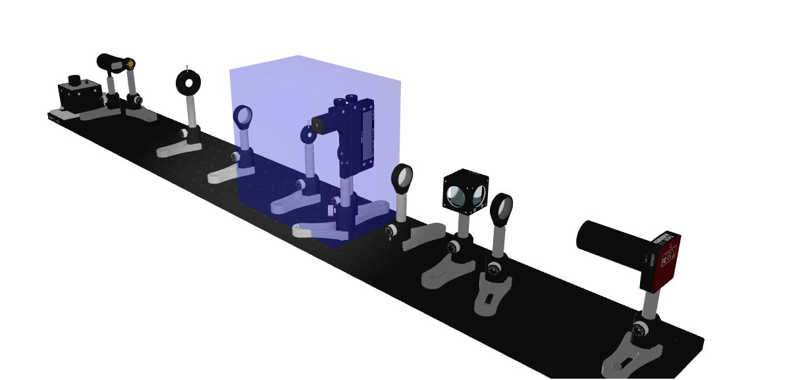
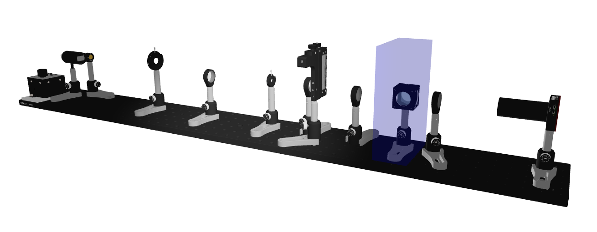

## 3D Documentation

Author: Harry Lonsdale

**Engine**

LabStream's 3D model component is built using [ThreeJS](https://threejs.org/) and [React Three Fiber](https://r3f.docs.pmnd.rs/getting-started/introduction), a react renderer for ThreeJS. Three.js is a powerful JavaScript library for creating 3D graphics in the browser using WebGL, providing direct control over scenes, cameras, lights, and objects. React Three Fiber (R3F) is a React renderer for Three.js that integrates with React's declarative approach, making it easier to manage and compose 3D components within a React application.

**Model**

The model for the scene is loaded from `/public/objs/coarse.obj`. The associated materials file specifying the textures for the model is `/public/objs/coarse.mtl`. We have found that using one unified CAD model for the entire scene, (instead of separated files for each component) leads to improved performance. The existing model, Fourier Optics, uses an OBJ (and accompanying MTL) file, but ThreeJS supports a number of file formats. The ThreeJS maintainers recommend using GLTF/GLB files for their optimized performance, but we encountered issues importing GLTF files with the correct textures from our CAD software, so we opted for OBJ/MTL instead. If possible, I would recommend using GLTF/GLB for future setups, and everything that follows this will still be possible once the model is loaded into the ThreeJS scene. [Learn more about rendering CAD files in ThreeJS here](https://threejs.org/docs/#manual/en/introduction/Loading-3D-models).

**Raycasting** 

Raycasting is used to detect user interactions with 3D objects in the scene. The raycasting model is implemented in the RaycastWrapper component, which is intentionally designed to be as portable as possible to other setups. The process follows these key steps:  

1. **Listening for User Clicks**  
   A `pointerdown` event listener is registered on the window to detect mouse clicks. When the user clicks, the `handlePointerDown` function is triggered.  

2. **Creating a Raycaster**  
   Within `handlePointerDown`, a new `THREE.Raycaster` object is instantiated, along with a `THREE.Vector2` to store the mouse position.  

3. **Converting Mouse Coordinates**  
   Since the mouse position is in pixel values, it is converted into normalized device coordinates (ranging from -1 to 1 on both axes). This ensures compatibility with Three.js’s coordinate system.  

4. **Casting a Ray and Detecting Intersections**  
   The raycaster projects a ray from the camera through the normalized mouse position using `raycaster.setFromCamera(mouse, camera)`. It then checks for intersections with objects in the scene using `raycaster.intersectObject(scene, true)`, returning a list of all intersected objects.  

5. **Processing the First Collision**  
   If any objects are intersected, the first intersection (closest to the camera) is retrieved, and its `faceIndex` and 3D intersection point are extracted. The `handleFaceClick` callback is then triggered with this data. This handler calls getLabelFromCoordinates to get the string name of the component that was clicked, if any. More info about how the labelling works can be found below in the "preparing your model for raycasting" section. 

This system allows for precise object interaction in a 3D scene, making it possible to detect and respond to user clicks on specific parts of a model.

**Preparing your model for raycasting**
As explained above, the RaycastWrapper handles all of the raycasting logic to locate clicks in 3D space in the scene. The next problem to solve is mapping clicks to components so that we can do something interesting with them (e.g. display a relevant label). To do so, the model must know where each component lies in 3D space. 

When setting up a new model, the key file to fill is one like `src/models/labels/labels.js`. This contains a list of your components including the name, description, and bounds for the cube containing it (minX, maxX, minY, maxY, minZ, maxZ). To populate this list, you'll need to determine the bounding boxes for the components. While there's no strict method for doing this, I'll share an efficient approach that worked well for me:

1. Add a translucent box to the scene in `RaycastWrapper.js`. You'll find the box component already exists in this file, just uncomment the lines to include it in the scene. This will let us visually "guess and check" bounds for each component. Make sure to run the project and observe the output change over the following steps.

Image 1: Visualize the box in the setup.

2. Manipulate the parameters of the box until you're happy with the bounds around the component. Write these down somewhere for now (google doc, sheet, etc.)

Image 2: Tune the parameters to find bounds for one component at a time.

3. Repeat step 2 until you have bounds for every clickable component in the scene

4. Add the bounds to `/src/models/labels/labels.js`, a file which stores constant information about your list of components. This is referenced by the raycasting click handler to determine which component was clicked. 

